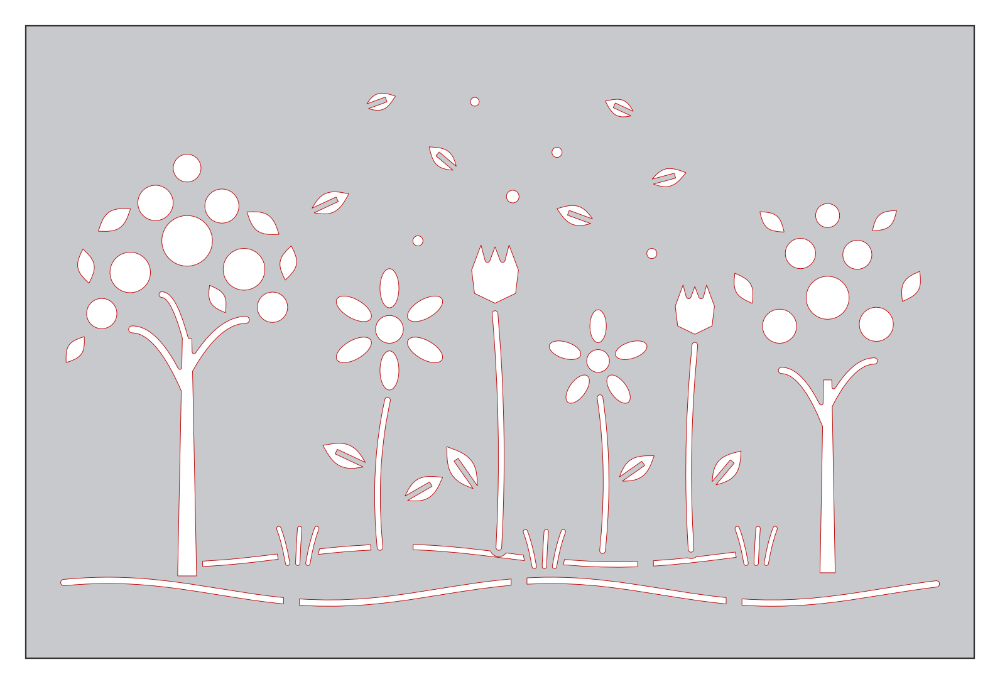

# Dekorativní panel — kytky, listy a stromy (laser)

Výkres pro laserové pálení dekorativního panelu z plechu.

## Parametry

| Parametr | Hodnota |
|---|---|
| Rozměr plechu | **1500 × 1000 mm** (na šířku) |
| Jednotky | mm, měřítko 1:1 |
| Motivy (otvory) | 79 uzavřených kontur |
| Celková délka řezu | ~18,9 m |
| Minimální můstek mezi otvory | ≥ 8 mm |
| Odstup motivů od okraje plechu | ≥ 25 mm |
| Minimální šířka drážky | 7 mm (tráva), stonky 9 mm |
| Doporučená tloušťka plechu | 1,5–3 mm |

## Soubory

- **`panel_kytky_1500x1000.dxf`** — hlavní soubor pro CAM laseru (DXF R12,
  maximální kompatibilita)
  - vrstva **`CUT`** (červená) — pálené kontury, všechny uzavřené
  - vrstva **`SHEET`** (modrá) — obrys plechu 1500×1000 + popisek; slouží jen
    jako reference, **nepálit** (případně smazat v CAMu)
- `panel_kytky_1500x1000.svg` — stejná geometrie ve vektorovém SVG (náhled,
  úpravy, případně přímý import do hobby laserů)
- `nahled.png` — obrázkový náhled (šedá = plech, bílá = vypálené otvory)
- `gen_panel.py` — generátor výkresu (Python, `shapely` + `ezdxf`); po úpravě
  parametrů lze výkres přegenerovat: `python3 gen_panel.py <výstupní_složka>`

## Poznámky pro pálení

- Všechny motivy jsou **otvory** — plech zůstane vcelku jako dekorativní panel.
- Kontury jsou uzavřené polyliny bez křížení, připravené přímo pro CAM.
- Listy mají středovou žilku řešenou jako 8mm můstek (list = dvě půlky),
  takže žádná část nevypadne a nevznikají ostrovy.
- Květy kopretin: střed a okvětní lístky jsou samostatné otvory s mezerou
  ≥ 8 mm.
- DXF R12 nenese informaci o jednotkách — při importu nastavit **mm**
  (kontrola: obrys plechu musí měřit 1500 × 1000).
